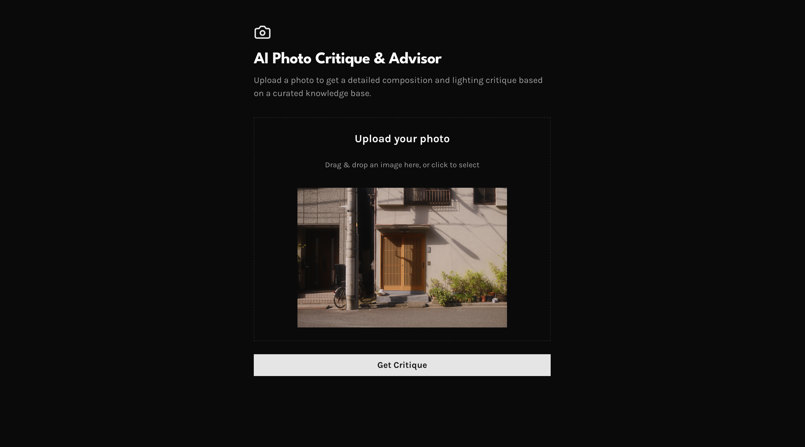

# AI Photo Critique & Advisor

[View Live Demo](https://photo-critic.reinaldo.pt) · [Report Bug](https://github.com/reinaldosimoes/ai-photo-critic/issues) · [Request Feature](https://github.com/reinaldosimoes/ai-photo-critic/issues)



## About This Project

This is a web app that lets you upload a photo and get a thoughtful, expert-level critique—powered by AI. Instead of generic tips, you'll get feedback based on real photography principles, thanks to a smart system that combines image analysis with a curated knowledge base.

The app is built with modern tools and includes features like rate limiting to keep things fair and sustainable for everyone.

## How It Works

1. **You upload a photo.**
2. **AI describes your photo.** The app uses OpenAI's GPT-4o to look at your image and write a detailed description of what's in it and how it's composed.
3. **It looks up photography advice.** That description is used to search a database (Pinecone) full of photography fundamentals—like the rule of thirds, lighting, and composition tricks.
4. **You get a custom critique.** The app combines the AI's description and the best-matching advice, then asks GPT-4o to write a helpful, personalized critique just for your photo.

## Tech Stack

- **Next.js** (web framework)
- **TypeScript** (language)
- **Tailwind CSS** (styling)
- **LangChain.js** (AI orchestration)
- **OpenAI** (AI model & embeddings)
- **Pinecone** (vector database)
- **Upstash Redis** (rate limiting)
- **Vercel** (deployment)

## Getting Started

### What You'll Need

- Node.js (v18 or newer)
- OpenAI API key
- Pinecone account & API key
- Upstash Redis account

### Setup Steps

1. **Clone the repo:**
   ```bash
   git clone https://github.com/reinaldosimoes/ai-photo-critic.git
   cd ai-photo-critic
   ```
2. **Install dependencies:**
   ```bash
   npm install
   ```
3. **Set up environment variables:**
   Copy the example file and fill in your keys:
   ```bash
   cp .env.example .env.local
   ```
4. **Prepare the knowledge base:**
   - Make a `data` folder in the project root.
   - Add your own PDF documents about photography principles to `/data`.
   - Run the script to load them into Pinecone:
     ```bash
     npx tsx scripts/ingest.ts
     ```
5. **Start the app:**
   ```bash
   npm run dev
   ```
   Then open [http://localhost:3000](http://localhost:3000) in your browser.

## Contributing

We welcome contributions of all kinds! If you have ideas for new features, spot a bug, or want to help with documentation, your input is appreciated. Here's how you can get involved:

- **Open an issue** for bugs, questions, or feature requests.
- **Fork the repo** and submit a pull request for improvements.
- **Share feedback** or suggestions to help us make the app better for everyone.

Not sure where to start? Check out the [issues page](https://github.com/reinaldosimoes/ai-photo-critic/issues) or open a discussion. All experience levels are welcome!

## License

MIT — see the [LICENSE](https://github.com/reinaldosimoes/ai-photo-critic/blob/main/LICENSE) file for details.

## Contact

Reinaldo Simoes — me@reinaldo.pt

Project Link: [https://github.com/reinaldosimoes/ai-photo-critic](https://github.com/reinaldosimoes/ai-photo-critic)
